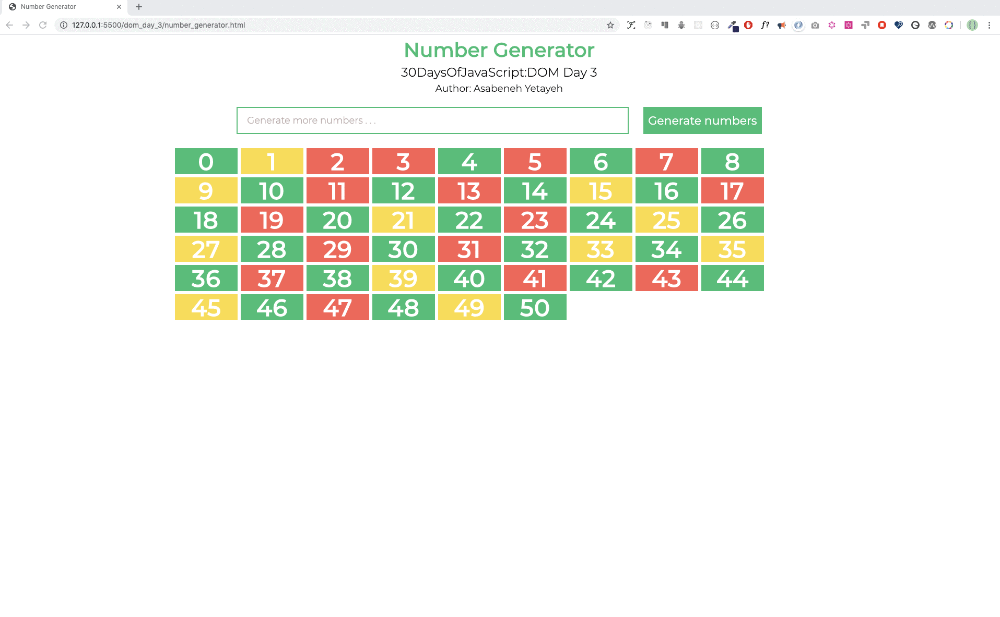

# 💻 Exercises

## Exercise: Level 1

1. Generating numbers and marking evens, odds and prime numbers with three different colors. See the image below.

2. Generating the keyboard code code using even listener. The image below.

